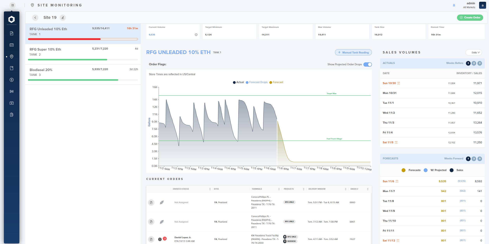
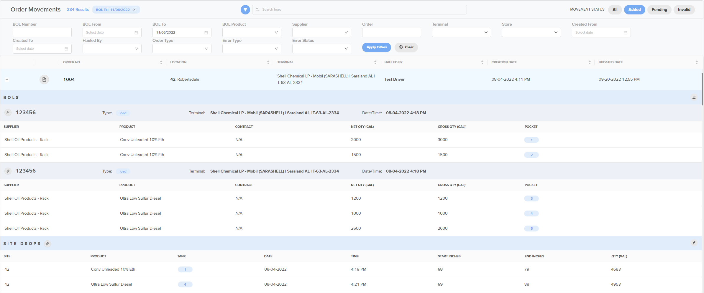
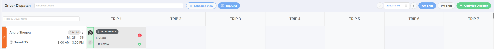

# Release Notes: October 18, 2022

<figure markdown>
  { width="300" }
</figure>

???+ Versions

    - 2022 Web Portal Version: (v.0.3.98)
    - In-Cab Version: 1.1.206

## Major Features

---

### Projected Deliveries

==FEATURE TYPE: WEB PORTAL==

Within Site Monitoring we’ve added a number of new features to assist with dispatching and
order planning. Driven by the switch above the tank projection chart you can now see what
your forecast looks like if you included any scheduled orders. Using the drivers’ eta, or carrier
window if eta is unavailable, we can now map out when to expect those deliverers and how
they will affect your tank volume, future scheduled orders, and projected sales. We’ve also
added ullage to the tool tip for quick and easy access to how much product you can put into
a tank at a given point in time. Lastly, we made the tank number more visible on Site
Monitoring, on the overview and detail pages, and in the Order Wizard as well.

<figure markdown>
  { width="500" }
  <figcaption>Site monitoring: site details</figcaption>

</figure>

### Delivery Tickets

==FEATURE TYPE: WEB PORTAL==

Delivery tickets have been added within Order Movements and will be available to view and
download for each order in the same manner that BOLs are accessible. Delivery tickets are
recorded alongside site drops and can be viewed, downloaded, and resent if needed. When
there are multiple delivery tickets for a single order those can be viewed and acted on
individually by selecting the store number the ticket is associated with.

<figure markdown>
  { width="500" }
  <figcaption>Order movements</figcaption>

</figure>

### Trailer Swaps

==FEATURE TYPE: WEB PORTAL==

Lastly, we’ve added a lot of functionality around driver equipment, specifically trailers and
trailer configurations. Within order dispatch you can now see what type trailer configuration
each order was created with and the trailer configuration each driver is assigned to.

<figure markdown>
  { width="500" }
  <figcaption>Order dispatch: driver grid</figcaption>

</figure>

If you dispatch an order onto a driver that has a trailer configuration that is different from that
of the order then the order will grow or trim to fit that driver's trailer. If you drag the order off
the driver then it will reset to how it was when it was generated by the model.

The second situation where an order can grow/trim automatically is if a driver logs in with a
trailer that has a different trailer configuration than the one set on their driver info page. Upon
login each order already assigned to that driver will adjust according to the new trailer
configuration, and the difference will be highlighted on the driver’s name card. The last situation
is when editing the order directly. If needed, the trailer configuration can be changed on the
order, when editing or creating, before dispatching to a driver.

<figure markdown>
  { width="500" }
  <figcaption>Order details</figcaption>

</figure>

Any changes made by Trailer Swap are recorded as Trailer Swap audits, which group all the
changes together so that they can be viewed as a single action. (This feature can be enabled
upon request)

<figure markdown>
  { width="500" }
  <figcaption>Order audit: flags</figcaption>

</figure>

## Bug Fixes and Minor Enhancements

---

### Minor Enhancements

=== "Web Portal"

    * Rewrite and Audit Order Overview - Improved filter results and page performance on Order Management
    * Reduced amount of time it takes for results to populate in Supply/Directives intraday report after model run
    * Exposed the Sales\_data\_upload endpoint for user accessibility
    * Exposed the Sales\_data\_upload endpoint for user accessibility
    * Replicated DSPs, Sites, and Tanks to Google Big Query for use in our ongoing analytics efforts
    * Improvements to the model when accounting for volumes, directives, and timezones
    * Added ability to require a photo for every single BOL, when entered by a driver

=== "Crossroads"

    * Added carrier integration that allows 3rd party carriers to send order updates back to Crossroads
    * Added features that allows order changes to be sent to a carrier and allow them to approve or reject that change

### Bugs

=== "Web Portal"

    * Fixed the date filters on Order Management
    * Fixed a bug where e-sticking showed a drop would fit when it was a no-fit
    * Fixed a bug where DSU updates for BOL saves and drop saves were not being populated
    * Fixed a bug in Site Monitoring where the weeks before/forward or hour before/forward were not changing the results
    * Fixed a bug where the wrong shift date was being recorded on some special pay requests
    * Fixed a bug on Site Monitoring page that was throwing an unexpected error

=== "In-Cab"

    * Fixed an issue where the BOL entry toggle was switching to ‘by pocket’ when attempting to enter ‘by total’
