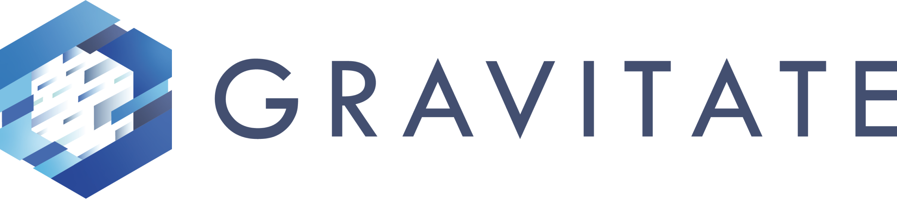

# Welcome to Gravitate Documentation

<figure markdown>
  { width="300" }
</figure>

For support requests visit [Gravitate Support Portal](https://gravitatedxp.atlassian.net/servicedesk/customer/portal/2).

This is a test site build with MKDOCS -- minimal effort and quite useful for documentation. It can be hosted in Github pages

We can add more to this as needed.
